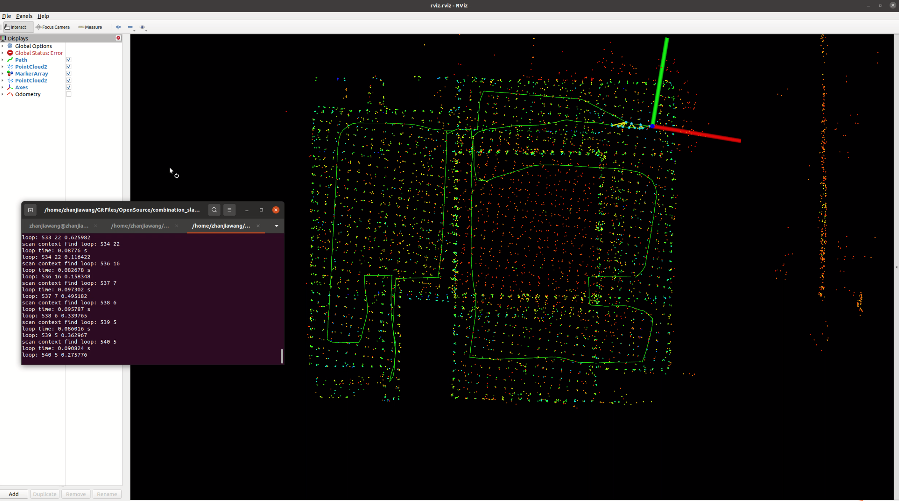
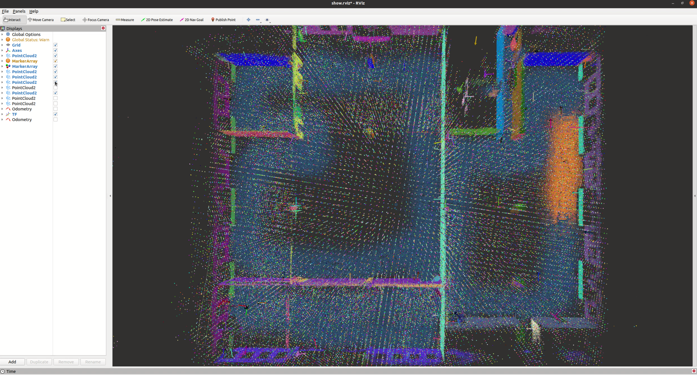
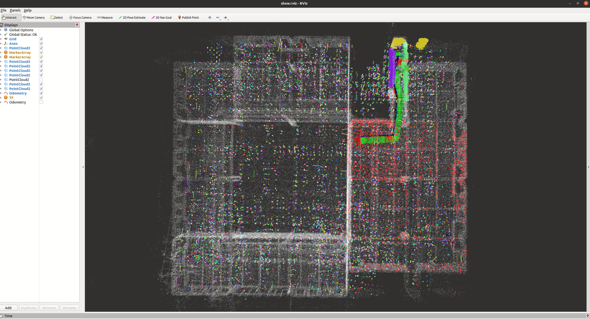

# combination_slam

`combination_slam` 是一个由独立的前端，后端，定位三个模块组成的代码独立但是功能可集成的slam框架。它特性包括：
- 前端里程计(lio_front_end)：目前集成了fast_lio和dlio(direct_lidar_inertial_odometry)，这些里程计都做了内存的处理，不会随着运行越来越久内存占用越来越多，适合长期运行
- 后端优化(sam_back_end)：基于lio_sam的后端剥离而成，支持回环检测(scan context, icp)，gnss输入，gtsam优化，数据保存
- 定位模块(recurrent_localization)：目前集成了context_localization和plane_localization，其中context_localization基于scancontext进行重定位基于八叉树NDT进行递推定位，plane_localization基于平面特征进行重定位基于八叉树NDT进行递推定位

## 依赖项

### 系统与 ROS

建议宿主环境：

- Ubuntu 20.04
- ROS noetic

### ROS / C++ 依赖

按 `combination_slam` 的 `CMakeLists.txt` / `package.xml`，需要：

- ROS 包
  - `roscpp`
  - `rospy`
  - `rosbag`
  - `rostest`
  - `message_generation`
  - `message_filters`
  - `std_msgs`
  - `sensor_msgs`
  - `nav_msgs`
  - `geometry_msgs`
  - `tf`
  - `pcl_ros`
  
- C++ / 第三方库
  - C++17
  - OpenMP
  - Boost
  - OpenCV (ROS自带版本)
  - PCL (ROS自带版本)
  - Eigen3 (系统自带版本)
  - GTSAM (建议4.2.0)
  - GeographicLib 

## 快速安装

### 1. 安装 ROS 依赖  (可选，若全新环境默认Desktop full版即可)

### 2. 安装 C++ 依赖 (可选，若全新环境可参考)

```bash
git clone https://github.com/geographiclib/geographiclib.git
cd geographiclib
mkdir build && cd build
cmake ..
sudo make install

wget -O gtsam.zip https://github.com/borglab/gtsam/archive/refs/tags/4.2.0.zip
unzip gtsam.zip
cd gtsam-4.2.0/
mkdir build && cd build
cmake -DGTSAM_BUILD_WITH_MARCH_NATIVE=OFF -DGTSAM_USE_SYSTEM_EIGEN=ON ..
sudo make install -j16
```

### 3. 编译

```bash
git clone https://github.com/zhanjiawang/combination_slam.git
cd combination_slam
catkin_make / catkin_make install
```

## 程序运行

### 建图

建图使用脚本 start_mapping.sh，需要根据安装路径修改脚本中的PROGRAM_PATH参数

注意：
- 前端里程计：不同的前端里程计在start_mapping.sh脚本中进行切换，整体来说dlio精度更高，但其cpu占用也更高些
- 前端里程计：可以支持览沃的CustomMsg和ROS的PointCloud2，对于fast_lio其分为lio_livox.launch和lio_point.launch进行区分；对于dlio其根据dlio_odom.launch中订阅的点云话题（pointcloud_topic和livox_topic）进行区分
- 后端优化：主要的参数配置项在sam_back_end/config/params.yaml，需要修改savePCDDirectory来指定建图数据（包括关键帧点云->/pcd、关键帧位姿->pose.json、scancontext特征->sc.bin、点云地图->FullMap.pcd、建图轨迹->trajectory.pcd等）的存放位置

### 重建

重建使用脚本 start_construct.sh，需要根据安装路径修改脚本中的PROGRAM_PATH参数

注意：
- context_localization：主要功能是根据建图得到的关键帧点云和关键帧位姿，重建一个八叉树地图，并计算八叉树地图节点的NDT分布特性，用于后续的NDT递推定位，其需要在params_construct.yaml中指定relative_path来确定数据（八叉树分布->octree_distribution.bin）存放的位置
- plane_localization：和context_localization中的重建差不多，不过在其的基础上再加了全局平面特征的提取，全局平面特征用于全局地图的重定位，其需要在params_construct.yaml中指定relative_path来确定数据（八叉树占用->octree_occupy.bin和全局平面特征octree_planes.bin）存放的位置

### 定位

定位使用脚本 start_localization.sh，需要根据安装路径修改脚本中的PROGRAM_PATH参数

注意：
- 获取重建数据：对于context_localization，需要在params_construct.yaml中指定relative_path来确定数据（八叉树分布->octree_distribution.bin）存放的位置；对于plane_localization需要在params_construct.yaml中指定relative_path来确定数据（八叉树占用->octree_occupy.bin和全局平面特征octree_planes.bin）存放的位置
- 递推定位器：不同的递推定位器在start_localization.sh脚本中进行切换，整体来说比较推荐context_localization（基于开源的scancontext更加稳健，对于非结构化场景适应性应该更好）；plane_localization提供全局的平面特征，具有不错优化空间和拓展的可能
- 定位数据输入：定位支持两种localization_mode输入：pure_point_cloud纯点云模式、pose_point_cloud位姿点云(里程计)模式，pure_point_cloud模式只要输入点云进行递推定位；pose_point_cloud需要同步的点云和里程计（可使用lio_front_end提供的，也可自行提供）作为输入，其相对pure_point_cloud更能保证运动剧烈时的定位成功率
- 重定位的三种模式：通过context_localization的/context_global_localization话题，为话题真实使用scancontext进行全局定位（优势->使用八叉树进行多结果验证），话题为假使用建图原点作初始定位值；通过plane_localization的/plane_global_localization话题，为话题真实使用平面特征进行全局定位（同样使用八叉树进行多结果验证），话题为假使用建图原点作初始定位值；通过/initialpose话题人工输入初始定位值
